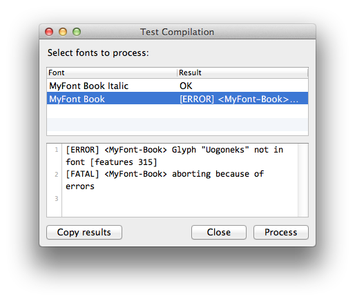

jkRFoTools
==========

Support libraries for RoboFont scripts.

### Installation:

Put the contents of the `Lib` folder into your Python site packages folder, usually `/Library/Python/2.7/site-packages`, or install via Terminal using the supplied script:

    sudo python setup.py install

### FontChooser.ProcessFonts

`ProcessFonts` will open a font chooser window. Then a supplied function will be called with each selected font as an argument. If the function returns a result string, it will be displayed in the lower part of the window. Select rows in the result list and double-click to copy the results to the pasteboard.

See https://github.com/jenskutilek/RoboFont/blob/master/scripts/TestFontCompilation.py for a demo script which uses `ProcessFonts`.